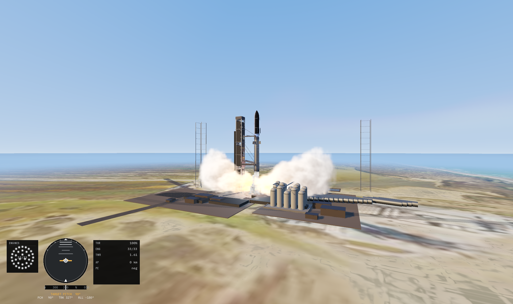
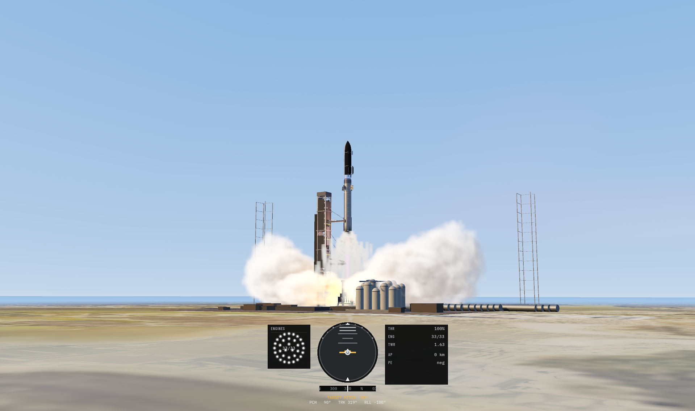

# Sebastian Velandia

Electronics engineer in Bogotá. The project that matters right now is **[Exosphere](https://github.com/sebastianvelace/Exosphere)**, a space-mission simulator in Godot 4.6 and C#. You fly a launch vehicle from the pad through ascent, orbit, and reentry, in a double-precision model of the solar system.

  
  

  
  
  
  

Sandbox flight from Starbase, prepared scenarios, a historical campaign, and a vehicle assembly building all use the same physics. Source is MIT. Open it in Godot 4.6.3 with .NET.

Also on this account: [rocketry-engineering](https://github.com/sebastianvelace/rocketry-engineering), [Rocky](https://github.com/sebastianvelace/Rocky), and a fork of [OpenRocket](https://github.com/sebastianvelace/openrocket).
